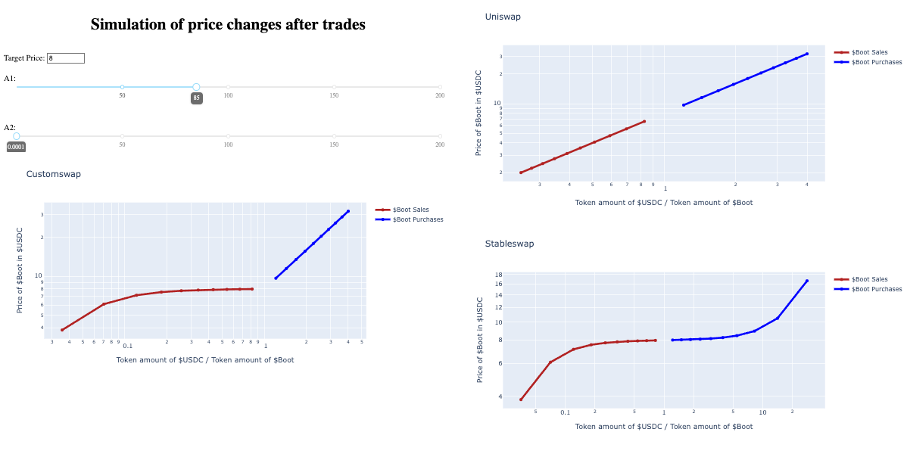

# Customswap Simulation Dashboard

Customswap is a new decentralized finance (Defi) automated market-maker (AMM) algorithm introduced by Boot Finance (blog post, litepaper). 

This repository contains:
* An implementation of Customswap in Python 
* An online interactive dashboard displaying the results of a trading simulation using Customswap. The user can change Customswap parameters and see the plots update in real-time:

 

A live demo of the dashboard is [available here](https://customswap.herokuapp.com/). Here is how the simulation work:
1. The simulation starts by creating an AMM pool containing 50,000 USDC and 50,000 Boot tokens.
2. It then conducts 10 buy trades and 10 sell trades starting from this pool. The trades change the ratio of tokens in the pool and hence change the price of Boot tokens, 
3. Boot token price is plotted against the ratio of tokens in the pool in a log-log plot. 
4. The steps above are repeated for AMM pools using Customswap, Stableswap and Uniswap algorithms.

